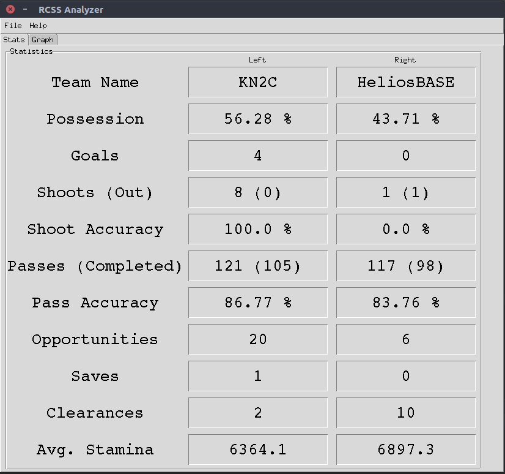

# Rcss2D Analyzer
### Analyzer for Robocup 2D Soccer Simulation 


<p>Written in python 3.6
<br>Takes in .rcg and .rcl files and analyzes different aspects of game.</p>

### Requirements
Install [Anaconda](https://anaconda.org/) for easier package management.

### How to use
Clone the project and run <br>
```shell
python main.py
```
<p><i>Development is still ongoing at KN2C Robotics Lab</i></p>
